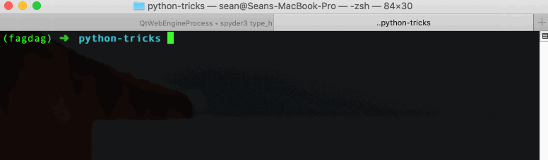
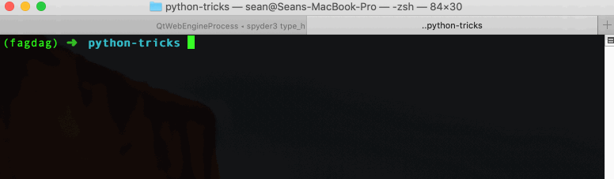

# Python coding style

> A Foolish Consistency is the Hobgoblin of Little Minds (PEP 8)

Code is read far more often than it is written. Concistency is very important, both for your colleagues and your future self.

[PEP 8](https://www.python.org/dev/peps/pep-0008/) addresses the issue of code consistency by introducing a style guide for Python programmers. This style guide is a set of recommendations and best practices that improve readability and consistency of Python code. 

In the following we briefly summarise some of the most important points. This is not an exhaustive list, please refer to [PEP 8](https://www.python.org/dev/peps/pep-0008/) for the complete style guide. [RealPython: How to Write Beautiful Python Code With PEP 8](https://realpython.com/python-pep8/) is also a nice guide. After reviewing some of the recommendations in PEP 8, we will briefly introduce linters and autoformatters.

## Naming conventions

In the table below we review some of the naming conventions recommended in PEP 8. In addition to these naming conventions, it is considered good practice to give variables, functions and classes descriptive names.

| Type     | Naming convention                                            | Example                                        |
| -------- | ------------------------------------------------------------ | ---------------------------------------------- |
| Function | Lowercase word or words separated by underscores.            | `function`, `my_function`                      |
| Variable | Lowercase single letter, word or words separated by underscores. | `x`, `var`, `my_variable`                      |
| Class    | Camel case, i.e. each word starts with a capital letter and not separated by underscores. | `Model`, `MyClass`, `MyLargeClass`             |
| Method   | Same as function.                                            | `method`, `class_method`                       |
| Constant | Uppercase single letter, word or words separated by underscores. | `CONSTANT`, `MY_CONSTANT`, `MY_LARGE_CONSTANT` |
| Module   | Short, lowercase word or words separated by underscores.     | `module.py`, `my_module.py`                    |
| Package  | Short, lowercase word or words. Do not separate with underscores. | `package`, `mypackage`                         |

## Code layout

**Whitespace.** Surround top-level functions and modules with *two blanklines*. Surround method definitions with *one blankline*. Use blanklines sparingly inside function definitions, preferably to separate code into logical, readable sections. 

```python
class FirstClass:
  pass


class SecondClass:
  def __init__(self):
    return None
  
  def method(self):
    return None
  
  
def top_level_function():
  return None
```

Furthermore, PEP 8 recommends:

* Avoid trailing whitespace.

* Always surround binary operators (e.g. `+`, `-`, `*`, `/`), assignment operators (e.g. `=` `+=`, etc.), comparisons (e.g. `<`, `>`, `<=`, etc.) and Booleans (e.g. `is`, `not`, `and`, `or`, etc.) with a single whitespace on either side.

* If operators with different priorities are used, consider adding whitespace with the lowest priorities, e.g. `(a+b) * (c+d)` and `x*2 - 1`. This point is usually a matter of personal taste, use your best judgement.

* In function annotation, normal rules for colon applies and `->` should be surrounded by whitespace on either side.

* In function arguments, do not use spaces around `=` when indicating keyword argument. Note the exception when annotating function arguments.

* ```python
  # Good
  def some_function(text, number=42):
    print(text)
    return number
  
  # Bad
  def some_function(text, number = 42):
    print(text)
    return number
  
  # Exception: Assigning default value to annotated argument
  def function(text: str, number: int = 42) -> int:
    print(text)
    return number
  ```

* Do not use whitespace before an open bracket that starts an index or a slice, an open parenthesis that starts an argument list of a function call, a comma, semicolon or colon.

**Maximum line length.** PEP 8 suggests limiting the maximum line length to *79 characters*. The preferred way of wrapping lines is by using Python's implied line continuation inside brackets, parenthesis and braces. These should be preferred to the backslash operator, which should be used sparingly (i.e. only when you have to).

**Indentation.** Whether to use tab or spaces for indentation is contentious issue. PEP 8 recommends using *four spaces to indicate indentation*, and that spaces should be preferred over tabs. If you prefer to use tab, you can set your text editor to output four spaces instead of a tab character.

**Trailing commas.** When code is under version control it can be helpful to use trailing commas even when they are redundant. This is because changes to the code will produce smaller diffs.

```python
# Adding a file to this list results in one new line instead of two in git
file_list = [
  "file_1.txt",
  "file_2.txt",
  "file_3.txt",
]
```

**Do not compare booleans to `True` or `False`.** It is enough to write e.g.

```python
my_bool = (6 > 5)

# Bad
if my_bool == True:
  return "Bad!"

# Good
if my_bool:
  return "Good!"
```

Note that empty sequences in Python are *falsy* and can be checked similarly to booleans:

```python
empty_list = []

# Bad
if not len(empty_list):
  print("List is empty!")

# OK
if len(empty_list) == 0:
  print("List is empty!")

# Better
if not empty_list:
  print("List is empty!")
```

## Linting

A linter is a tool that automatically checks your code for lint. Lint is a piece of code which contains 

1. logical errors and/or 

2. deviations from stylistic conventions.

One of the most popular linters for Python is `flake8`, which actually [combines several different linters](http://flake8.pycqa.org/en/latest/) into one handy package. It is able to detect both logical errors and code that does not conform to the stylistic conventions outlined in PEP 8.

Most IDEs have linters built into their software and perform checks automatically. Alternatively, linters such as `flake8` can be applied through a command line interface as illustrated in the following example.

**Linting example.** Consider the script `linting_example.py`, which contains both logical and stylistic errors (ignore the commented out text at the top, these are created by default in Spyder):

```python
#!/usr/bin/env python3
# -*- coding: utf-8 -*-
"""
Created on Tue Aug 13 10:33:27 2019

@author: sean
"""

def print_text(some_text =None):
    if some_text is None
        print("Give me some text to print!")
    else:
        print(some_text)
```

To check the script for errors, simply type `flake8 linting_example.py` in you terminal. In my shell, this results in the following output:



The syntax of the error message is

`filename:line:character: ERROR CODE followed by detailed error message`.

**Important:** `flake8` tells you what is wrong, it *does not fix it* for you. A comprehensive [list of error types](http://flake8.pycqa.org/en/2.5.5/warnings.html) can be found in [the documentation](http://flake8.pycqa.org/). `flake8` has several options for ignoring certain error types. Again, check the documentation for more information.

The script `linting_example_fixed.py` addresses the list of errors above. Specifically, we

* added blank line between commented out text and function declaration.
* removed leading whitespace to function argument.
* fixed syntax error in `if` statement.
* added a new line at end of script.

```python
#!/usr/bin/env python3
# -*- coding: utf-8 -*-
"""
Created on Tue Aug 13 10:33:27 2019

@author: sean
"""


def print_text(some_text=None):
    if some_text is None:
        print("Give me some text to print!")
    else:
        print(some_text)

```

This time, running `flake8 linting_example_fixed.py` in the terminal results in no output, indicating that everything is OK:


## Autoformatting code

As mentioned earlier, linters can help you detect errors but they don't necessarily fix them. Fortunately, there are tools in Python which both lint and format your code. My favourite is `black` (install with  `pip install black`).

`black` is a [highly opinionated autoformatter](https://black.readthedocs.io/en/stable/index.html) that refactors your code *in place* so that it conforms to a strict superset of PEP 8 guidelines. In other words, `black` ensures that all your code is PEP 8 compliant.

Furthermore, `black` makes some idiosyncratic code formatting choices, such as setting the default maximum line length is set to *88 characters* instead of 79 and replacing all single quotes `'` with double quotes `"`. Note that maximum line length is one of the few optional features of `black`; it is intentionally uncompromising.

**Black example.** Consider the script `pre_black.py`. This code is not PEP 8 compliant, mostly due to whitespace errors and line length:

```python
#!/usr/bin/env python3
# -*- coding: utf-8 -*-
"""
Created on Tue Aug 13 12:45:19 2019

@author: sean
"""
from typing import Dict, List

dict_example= {'key1': 1, 'key2': 2, 'key3' : 3, 'key4': 4}
list_example = [1, 2, 3, 4, 555555 , 678, 9, 0 , 234]
string_example = 'this is a string' 

def long_function(input_dictionary: Dict[str, int], list_of_numbers: List[int], a_text_variable: str, another_variable:int) ->None:
    """This is a function with arguments and documentation that exceeds PEP 8's recommended maximum line length."""
    return None
```

To autoformat, run the command `black pre_black.py` in the terminal. **Remember:** `black` formats your code in place!



The output indicates that errors have been detected and that the file `pre_black.py` has been reformatted. After running `black`, the script looks like this:

```python
#!/usr/bin/env python3
# -*- coding: utf-8 -*-
"""
Created on Tue Aug 13 12:45:19 2019

@author: sean
"""
from typing import Dict, List

dict_example = {"key1": 1, "key2": 2, "key3": 3, "key4": 4}
list_example = [1, 2, 3, 4, 555555, 678, 9, 0, 234]
string_example = "this is a string"


def long_function(
    input_dictionary: Dict[str, int],
    list_of_numbers: List[int],
    a_text_variable: str,
    another_variable: int,
) -> None:
    """This is a function with arguments and documentation that exceeds PEP 8's recommended maximum line length."""
    return None

```

**Note:** `black` does not have an opinion on docstrings. [Check the documentation](https://black.readthedocs.io/en/stable/the_black_code_style.html) for a complete overview over the black code style.

`black` is typically run as a pre-commit hook or as a part of a continuous integration build process.

## Summary

Code consistency is important. [PEP 8](https://www.python.org/dev/peps/pep-0008/) outlines a set of coding style recommendations for Python programmers. Linters like `flake8` will help you detect logical errors and code that is not compliant with PEP 8. Autoformatters such as `black` will automatically refactor your code so that it conforms to PEP 8 standards.

## Resources

TODO